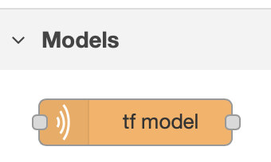
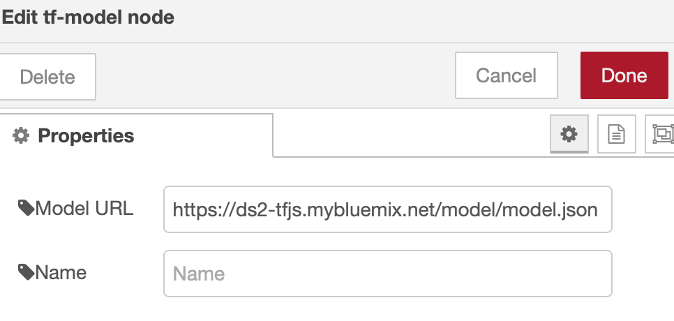

# node-red-contrib-tf-model

This is a Node-RED custom node which is used to load TensorFlow models and
perform inference. Currently, it only supports the web-friendly JSON model format
which is mainly used by TensorFlow.js. The SavedModel format will be added soon.

## Installation

### Prerequisite

This module requires `@tensorflow/tfjs-node` as a peer dependency. You need
to install it within Node-RED manually.  TensorFlow.js on Node.js
([@tensorflow/tfjs-node](https://www.npmjs.com/package/@tensorflow/tfjs-node)
or
[@tensorflow/tfjs-node-gpu](https://www.npmjs.com/package/@tensorflow/tfjs-node-gpu)),
depend on the TensorFlow shared libraries. Putting TensorFlow.js as the
dependency of a custom Node-RED node may cause the situation where multiple
custom nodes each install their own `tfjs-node` module as a dependency. This causes
an attempt at loading multiple TensorFlow shared libraries in the same process, which
subsequently causes the process to abort with a protobuf assertion error.

Install `@tensorflow/tfjs-node`:
```
npm install @tensorflow/tfjs-node
```

#### Note:
If you are planning to run this `node-red-contrib-tf-model` node on a Jetson Nano or Raspberry Pi 4,
note that the latest `@tensorflow/tfjs-node` does not yet support the ARM64 or ARM32 architectures.
Here are the instructions for installation:

`@tensorflow/tfjs-node` on Jetson Nano and Raspberry Pi 4:
- The version must to be equal or greater then 1.5.1 (up to 1.7.3)
- Run the following command to install `tfjs-node`:
  ```
  npm install @tensorflow/tfjs-node@1.x.y
  ```
  Please append the version you need. i.e @tensorflow/tfjs-node@1.5.1.
  You will see an error message while downloading/installing/compiling the shared libraries
  and node binding, but the JavaScript libraries are installed.
- Find the `tfjs-node` package directory on your local system. Usually it would be under `node_modules/@tensorflow/tfjs-node`
  from the directory you run the `npm install` command. Switch to this directory.
  directory.
  ```
  cd node_modules/@tensorflow/tfjs-node
  ```
- For the Jetson Nano, you need to provide a file named `custom-binary.json` under the
  `scripts` directory with the following contents:
  ```
  {
    "tf-lib": "https://s3.us.cloud-object-storage.appdomain.cloud/tfjs-cos/libtensorflow-gpu-linux-arm64-1.15.0.tar.gz"
  }
  ```
- For the Raspberry Pi 4, you need to provide a file named `custom-binary.json` under the
  `scripts` directory with the following contents:
  ```
  {
    "tf-lib": "https://s3.us.cloud-object-storage.appdomain.cloud/tfjs-cos/libtensorflow-cpu-linux-arm-1.15.0.tar.gz"
  }
  ```
- Run the following command under the `node_module/@tensorflow/tfjs-node` directory:
  ```
  npm install
  ```
  This will download the pre-compiled TensorFlow shared library binary and build the node binding.

### Install this module:
Once you have installed the peer dependency, you can install this module:
```
npm install node-red-contrib-tf-model
```

## Usage

You can see the `tf-model` node in the `Models` category, like this:



Then you can use the `tf-model` node in your flow. It only needs one property:
`Model URL`.



The `Model URL` should point to a TensorFlow.js model which is in web-friendly
format. Typically, it should be a model JSON file. After you specify the
`Model URL` and deploy the flow, it will fetch the model files, including
shard files, and store them in `${HOME}/.node-red/tf-model` directory.
You can also use a model from the local file system (e.g.
`file:///home/mymodel/model.json`). The new node will load the model and
maintain the cache entry. You can specify the `Output Node` name when running
model inference. By default, it uses that last node as the output node.

## Data Format

When performing infernce using a  TensorFlow.js model, you need to pass the
corresponding `msg.payload` to the `tf-model` node. The `msg.payload` would be a
`tf.NamedTensorMap` object containing all the needed features in the `tf.Tensor`
data type for the model. When a model is loaded, the input node list is output
to the console which can help you to build the input named map for the model.

Example input to `tf-model` node:

```
{
  payload: {
    image_tensor: image
  }
}
```

In the example above, `image_tensor` is the input node name of the model and
`image` is a `tf.Tensor` object.


By default, the prediction runs through the whole model graph and returns the
final output of that last node. You can use `Output Node` to specify a different
node as the output node. After model prediction, results are passed to the next
node in `msg.payload`. It could be a `tf.Tensor` or `tf.Tensor[]`.

## Examples
We have provided some example flows under the **examples** folder. They may help you to
understand the usage of the `tf-model` node and other Node-RED custom nodes we
provide.
- [Object Detection](examples/object-detection)
- [BERT Sentiment Analysis](examples/bert-sentiment-analysis)
